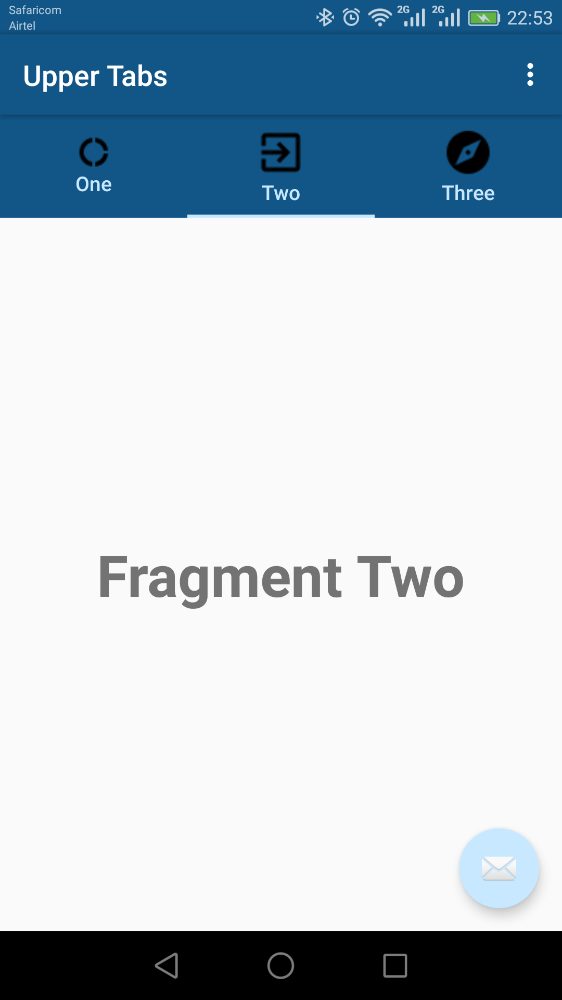
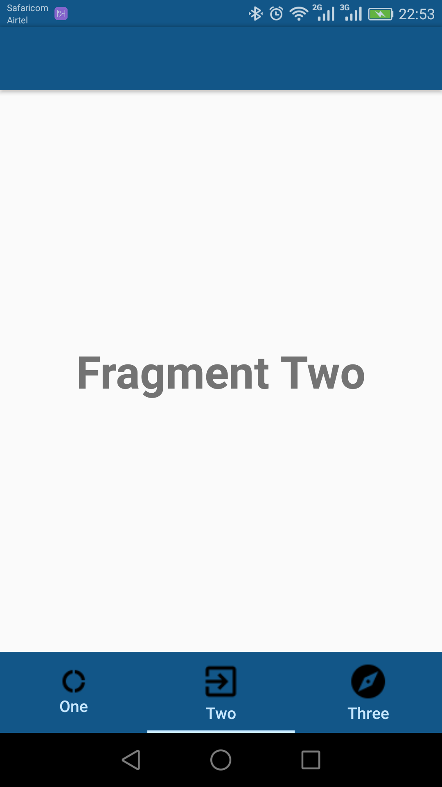

# Android_material_design_demo
Android Material Design Example

Import the application in android studio and see how android material design can be implemented.

Upper Tabs
[]

Lower Tabs
[]

## Used Tech
- Java
- Material design

### From Developers

I am always happy to receive your feedback!
FInd me on [Twitter](https://twitter.com/julian_geniuz)!
